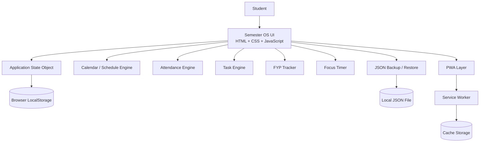
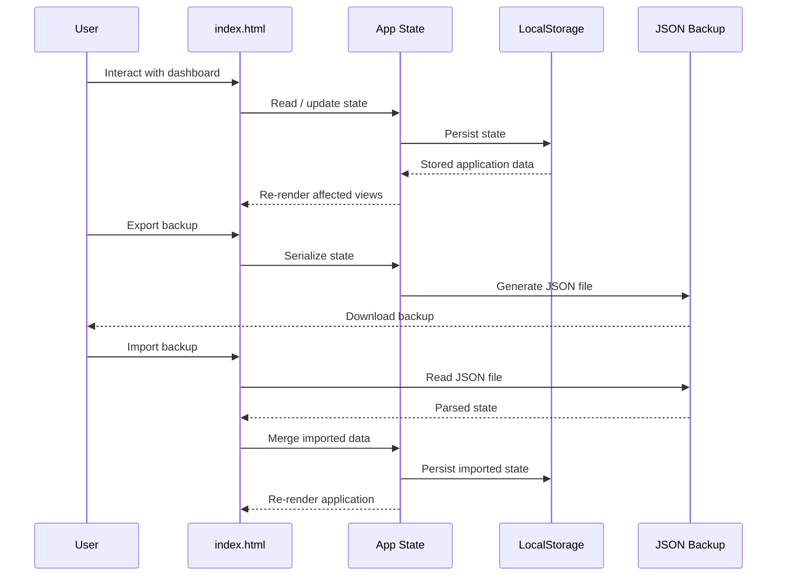
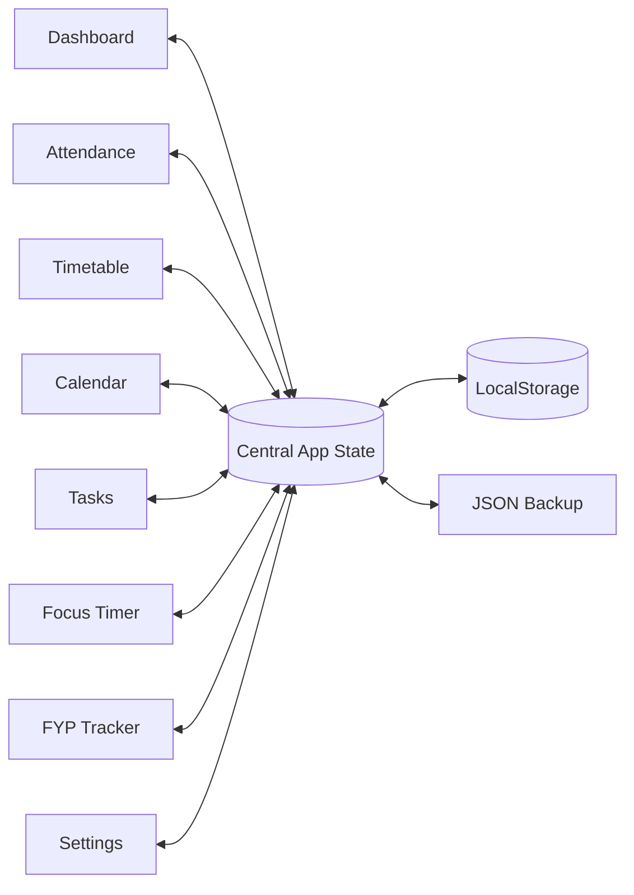
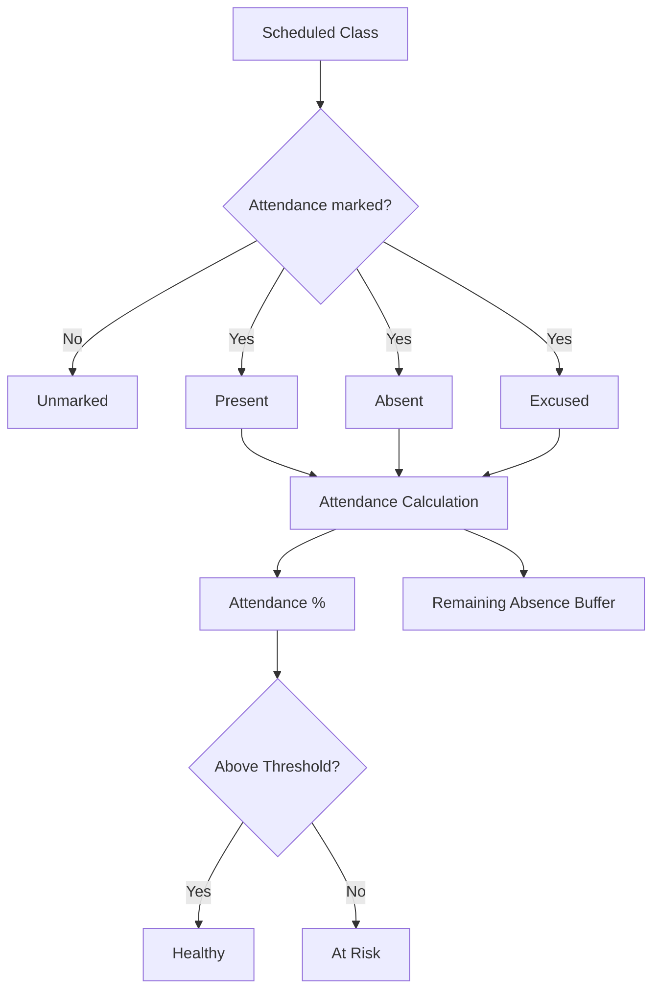
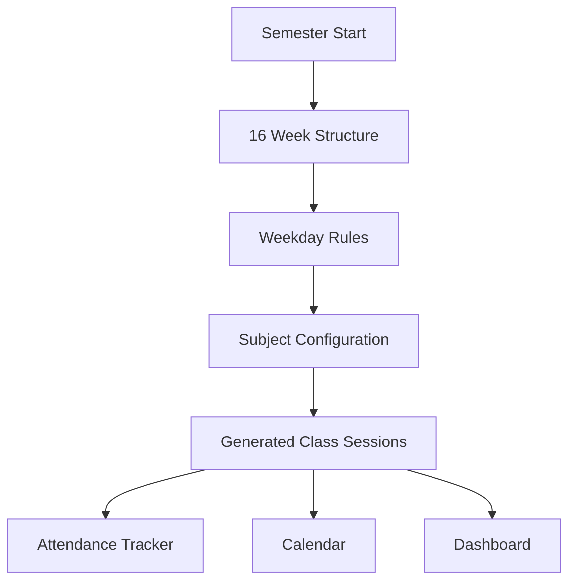
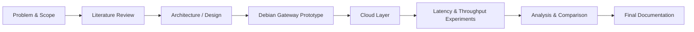
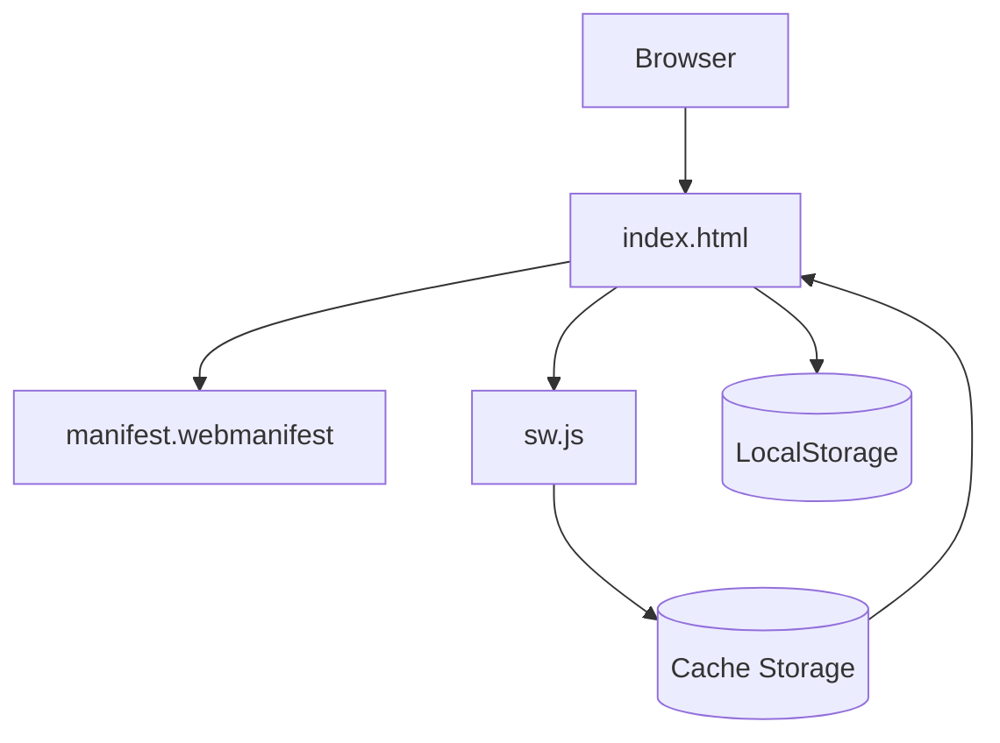
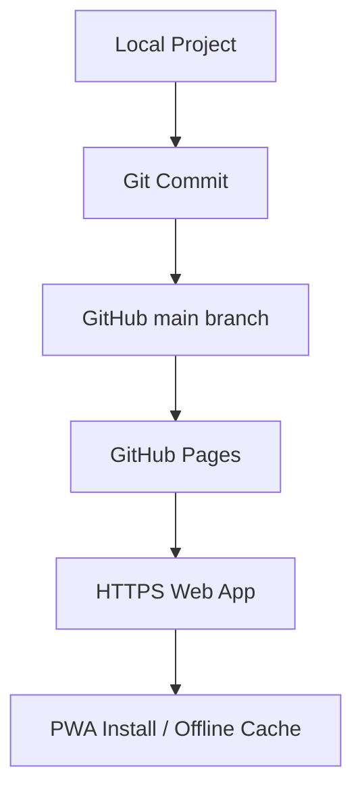

# 🎓 Semester OS — 7th Semester

> **An offline-first academic operating system for managing an entire university semester from one responsive web app.**

Semester OS combines **attendance intelligence, timetable planning, calendar management, task execution, focus sessions, exam countdowns, and Final Year Project (FYP) tracking** into a single zero-backend application.

It was designed around a practical problem: university life is fragmented across calendars, spreadsheets, notes, to-do lists, and timer apps. Semester OS turns those disconnected activities into one local-first workspace.

---

## ✨ What This Project Does

Semester OS is a **single-page, dependency-free Progressive Web App (PWA)** built with standard web technologies.

### Core modules

| Module | Purpose |
|---|---|
| 🏠 Dashboard | Semester overview, attendance health, upcoming deadlines and countdowns |
| 📊 Attendance | Track Present / Absent / Excused / Unmarked sessions and calculate attendance percentage |
| 🗓️ Timetable | Monday–Thursday weekly schedule and 16-week semester structure |
| 📅 Calendar | Visualize classes, tasks and academic milestones |
| ✅ Tasks | Track assignments, university work, Azure preparation, FYP work and personal tasks |
| ⏱️ Focus | 15 / 25 / 50-minute focus sessions |
| 🎓 FYP | Track research/project milestones and evidence requirements |
| ⚙️ Settings | Theme, attendance threshold, exam dates, backup/restore and reset |

### Key capabilities

- Responsive mobile + desktop UI
- Light / dark mode
- LocalStorage persistence
- Offline-capable PWA shell
- No backend
- No database
- No API keys
- No build step
- JSON backup / restore
- Configurable attendance threshold
- Automatic remaining-absence calculation
- Azure certification countdown
- Final-exam countdown
- FYP milestone tracking
- Calendar and task integration

---

## 🧱 Architecture

The application intentionally uses a **local-first architecture**. There is no remote application server or database.



### Architectural principles

1. **Local-first** — user data remains in the browser.
2. **Zero backend** — no server is required to operate the tracker.
3. **Progressive enhancement** — the core app works as a normal webpage; the PWA layer adds installability and offline caching.
4. **Single-file application core** — the UI and application logic live in `index.html` to keep deployment extremely simple.
5. **Portable data** — the complete state can be exported as JSON and restored on another browser/device.

---

## 🔄 Application Data Flow



---

## 🧩 Functional Architecture



This is deliberately **not** a conventional multi-tier backend architecture. The state boundary is inside the browser because the application's primary requirement is personal academic tracking rather than multi-user collaboration.

---

## 📚 Semester Configuration

| Subject | Days | Planned Classes | Type |
|---|---:|---:|---|
| Internet of Things | Monday + Wednesday | 32 | Course |
| Cloud Computing | Tuesday + Wednesday | 32 | Course |
| Machine Learning | Wednesday | 16 | Course |
| Compiler Construction | Monday + Tuesday | 32 | Course |
| Cloud Computing Lab | Thursday | 16 | Lab |
| Machine Learning Lab | Thursday | 16 | Lab |

### Academic dates encoded in the application

- **Semester:** 31 August 2026 – 1 January 2027
- **Mid-Term Examination:** 26–30 October 2026
- **Course Withdrawal Deadline:** 13 November 2026
- **Winter Vacation:** 21–25 December 2026
- **Final-Term Examination:** 4–8 January 2027
- **Azure Certification Exam:** 12 October 2026 by default

> Dates are configurable where appropriate. The attendance threshold defaults to **75%** and should be changed if the official departmental policy differs.

---

## 📊 Attendance Logic

Each session can be `Present`, `Absent`, `Excused`, or `Unmarked`. The application calculates attendance percentage and estimates the remaining absence buffer against the configured threshold.



For the default 75% threshold:

- A 32-class subject permits up to **8 absences** while maintaining 75% or better.
- A 16-class subject permits up to **4 absences**.

These are planning calculations, not a replacement for official university attendance rules.

---

## 🗓️ Timetable & Calendar Model



The schedule engine follows the supplied timetable totals and does not silently rewrite class counts based on vacation periods.

---

## 🎯 FYP Execution Model



Default milestones:

1. Scope & problem statement
2. Literature review
3. Architecture/design
4. Debian gateway prototype
5. Cloud layer implementation
6. Latency & throughput experiments
7. Analysis & final documentation

---

## 📱 PWA / Offline Architecture



The PWA layer provides installable metadata, an app icon, service-worker caching, a basic offline shell and persistent local application state.

> Service workers require a secure origin such as HTTPS. `file://` opening works for the core app, but PWA installation/offline service-worker behavior should be tested from GitHub Pages or another HTTPS host.

---

## 🗂️ Project Structure

```text
Semester_OS_7th_Semester_Tracker/
├── index.html
├── manifest.webmanifest
├── sw.js
├── icons/
│   └── icon.svg
├── docs/
│   └── screenshots/
│       └── .gitkeep
├── README.md
├── README.txt
├── LICENSE
└── .gitignore
```

---

## 🚀 Run Locally

### Direct

Open `index.html` in a modern browser.

### Static server

```bash
python -m http.server 8000
```

Open `http://localhost:8000`.

A local HTTP server is preferable when testing the service worker. Use an HTTPS deployment for real PWA installation.

---

## 💾 Data & Privacy Model

Semester OS is local-first. It has no authentication system, backend API, remote database, analytics service or required API key.

Stored locally:

- Attendance records
- Tasks
- FYP progress
- Focus timer state
- Theme preference
- Attendance threshold
- Exam dates
- Other application state

Use **Settings → Export backup** periodically. Backup JSON files contain application state and should be treated as personal data.

---

## 🛠️ Technology Stack

| Technology | Role |
|---|---|
| HTML5 | Application structure |
| CSS3 | Responsive UI, themes and components |
| Vanilla JavaScript | Application logic and state management |
| LocalStorage API | Persistent local data |
| Web App Manifest | PWA metadata / installation |
| Service Worker API | Offline shell / caching |
| JSON | Portable backup format |
| Mermaid | Architecture and workflow diagrams |
| Git / GitHub | Version control and distribution |

**Runtime dependencies: none.** No npm, Node.js, React, Vue, Angular, Tailwind, Bootstrap or backend is required.

---

## 🧪 Testing Checklist

- [ ] Desktop layout
- [ ] Mobile layout
- [ ] Light/dark mode
- [ ] Navigation
- [ ] Present/Absent/Excused attendance
- [ ] Attendance percentage and buffer
- [ ] Threshold configuration
- [ ] Task creation/completion/deletion
- [ ] Due dates and priorities
- [ ] LocalStorage persistence after refresh
- [ ] JSON export/import
- [ ] Reset flow
- [ ] Manifest loads
- [ ] Service worker registers on HTTPS
- [ ] PWA installation works where supported
- [ ] Academic dates are correct

---

## 🌐 GitHub Pages Deployment

Semester OS is a static site, so GitHub Pages is a natural deployment target.



After pushing the repository, enable GitHub Pages for the `main` branch and repository root (or the Pages source available in repository settings). The service worker can then operate from the HTTPS GitHub Pages origin.

---

## 🔐 Security Considerations

1. Never put passwords, API keys or secrets into `index.html`.
2. Do not commit exported JSON backups containing personal academic information.
3. Keep `.gitignore` updated for local backup files.
4. Treat a public GitHub Pages deployment as public.
5. Do not store sensitive credentials in LocalStorage.

---

## 🧭 Future Roadmap

- [ ] Editable class times / lecture periods
- [ ] Attendance forecasting: “If I miss the next N classes…”
- [ ] Automatic current-week highlighting
- [ ] “Today” and “Next Class” cards
- [ ] Holiday-aware session management
- [ ] Makeup-class support
- [ ] Individual session editing/cancellation
- [ ] Persistent FYP evidence checklist
- [ ] Task editing from the UI
- [ ] Weekly workload analytics
- [ ] Study streaks and productivity statistics
- [ ] Grade / marks tracker
- [ ] Optional cloud synchronization
- [ ] Optional authentication and multi-device sync

---

## 📸 Screenshots

Add real screenshots to `docs/screenshots/` as the project evolves. Suggested evidence set:

```text
docs/screenshots/
├── dashboard.png
├── attendance.png
├── timetable.png
├── calendar.png
├── tasks.png
├── focus.png
├── fyp.png
├── settings.png
└── mobile-home-screen.png
```

Screenshots should represent actual tested application states rather than fabricated UI evidence.

---

## 📄 License

MIT License. See [`LICENSE`](LICENSE).

---

## 👤 Project

**Semester OS — 7th Semester**

A personal academic management system combining semester planning, attendance intelligence, task execution, focus management and FYP progress tracking in one offline-first web application.
